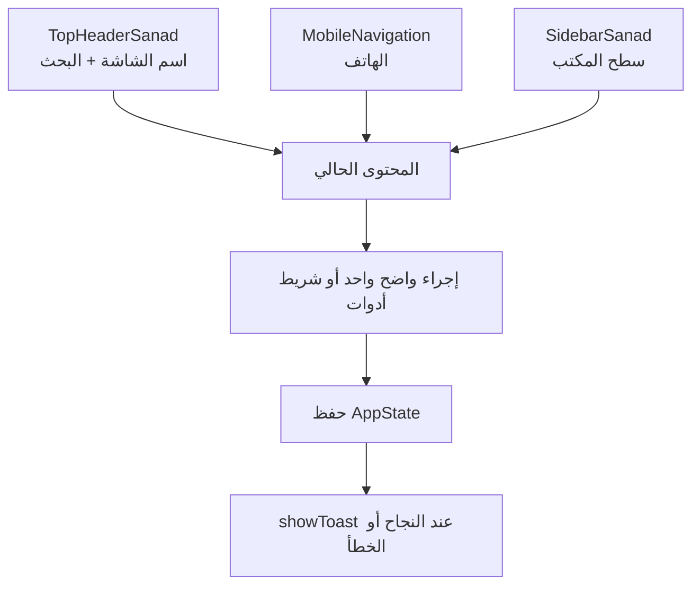
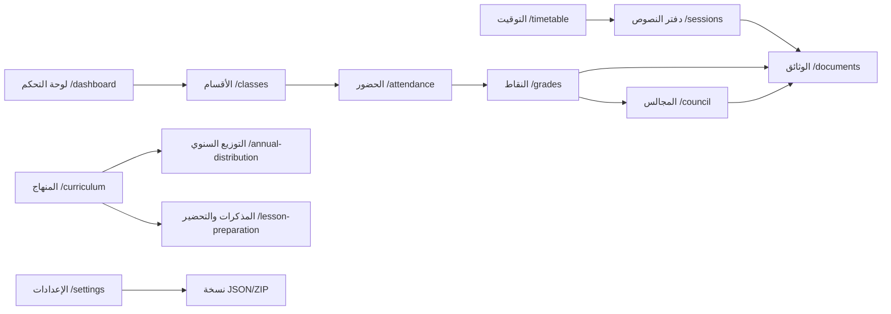
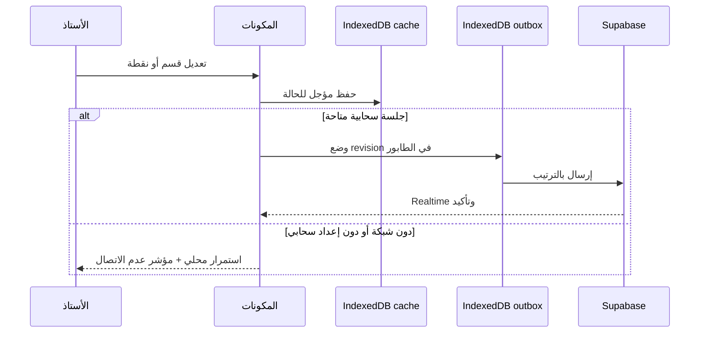

# دليل التصميم وتجربة الاستخدام

هذا الدليل يصف اللغة البصرية وسلوك الواجهة الفعليين في «معين الأستاذ». الهدف
هو مساعدة أستاذ العلوم الإسلامية على إنجاز العمل المتكرر بسرعة، مع إبقاء
البيانات مفهومة وقابلة للطباعة على الهاتف والحاسوب.

## 1. مبادئ UX

### سياق واحد، لا تنقل زائد

الشاشة تعمل حول قسم نشط وفصل نشط. ينتقل الأستاذ بين المهام من شريط واحد، ولكل
وظيفة مسار مستقل قابل للفتح والإشارة المرجعية (`/dashboard` و`/classes`
و`/attendance` و`/grades` و`/council` و`/sessions` و`/annual-distribution`
و`/curriculum` و`/timetable` و`/lesson-preparation` و`/documents`
و`/settings`). لا تستخدم `?tab`؛ يحدد المسار الشاشة، ويمكن حفظ سياق القسم
داخل الحالة عند الحاجة.

### Mobile-first Native

- الهاتف: شريط سفلي للوصول السريع وقائمة جانبية عند الحاجة.
- سطح المكتب: شريط جانبي قابل للطي ومساحة عمل أوسع للجداول.
- لا نضع عنوان صفحة ثانياً داخل المحتوى؛ العنوان الرسمي في `TopHeaderSanad`.
- الأهداف اللمسية كبيرة، والنصوص قصيرة، والجداول قابلة للتمرير الأفقي عند
  ضيق الشاشة.
- `app/layout.tsx` ومسارات العرض الخفيفة Server Components افتراضياً؛ الحاوية
  التفاعلية والمكونات التي تستخدم hooks أو أحداث المتصفح Client Components.
  لا تعبر كائنات المتصفح أو hooks حدود RSC، وتمّرر الحالة والأفعال عبر Props.

### حالات واضحة وآمنة

كل عملية طويلة تعرض حالة تحميل. الحذف أو التعديل الحساس يمر عبر
`ConfirmDialog`. النتيجة أو فشل الحفظ يظهر عبر `showToast`؛ يمنع استخدام
`alert()` و`prompt()` و`confirm()`.

## 2. الهيكل البصري والهوية

### الهوية البصرية وشعار التطبيق (Brand Identity & Iconography)

* **الرمز الرسمي:** ريشة قلم حبر كلاسيكية تنبثق من كتاب مفتوح، ممتزجة برذاذ ألوان مائية زرقاء بترولية ولمسات رقائق الذهب. يجسد هذا الرمز رسالة التعليم القرآني والنبوي، والتوثيق والتدوين، والبيداغوجيا الحديثة.
* **الألوان المعتمدة في الشعار والأيقونة:**
  * **خلفية الأيقونة (Canvas Tint):** `#E1EDF6` ناعمة وممتدة بنسبة 100% إلى كافة الحواف.
  * **اللون الأساسي (Primary Teal):** `var(--primary)` / `#2E7D9B`.
  * **حبر التدوين الداكن (Deep Ink):** `#1E4056`.
  * **لمسات الذهب البيداغوجية (Gold Leaf):** `#CBA135` / `var(--accent-gold)`.
* **معايير هندسة الأيقونة (PWA & Native Icon Rules):**
  * **منطقة الأمان (Safe Zone 80%):** تتركز كتلة الرسم الأساسية (الكتاب والقلم) داخل دائرة وهمية بنصف قطر 40% من عرض الكانفاس، لضمان عدم اقتطاع أي تفصيل عند تطبيق الأقنعة التكيفية في Android (دائرة، مربع مستدير، بيضاوي) أو Squircle في iOS.
  * **منع شوائب الموكاب (No Mockup Artifacts):** يُمنع تماماً وضع ظلال خارجية ثلاثية الأبعاد (Drop Shadows) أو تأثيرات حواف البطاقات (Bevels) أو خلفيات ورقية مصورة داخل ملفات الأيقونات؛ يجب أن تكون الخلفية ممتدة ونظيفة.
  * **استخدام الأيقونة:**
    * **أيقونة مشغل التطبيق (Launcher / PWA):** الشعار المعتمد المصحوب بكاليغرافي "مُعِين" العربي (`brand-logo-text.png`) ومقاساته التكيفية مع مراعاة منطقة الأمان (Safe Zone 80%).
    * **شاشات الترحيب والإقلاع (Splash Screen & Auth Hero):** الرمز مدمجاً مع كاليغرافي "مُعِين" بالخط العربي الأصيل (`brand-logo-text.png`).

### لوحة الألوان (Color Palette)

الثيم فاتح فقط ويستخدم Slate + Ocean:

| المتغير | الاستخدام |
| --- | --- |
| `--primary` | الإجراء الأساسي، الحالة النشطة، والتقدم |
| `--primary-hover` | تمرير الزر الأساسي |
| `--primary-soft` | خلفية العناصر النشطة والرموز |
| `--accent-navy` | الشريط الجانبي والهوية |
| `--accent-gold` | العلامات المهنية والتنبيهات المهمة |
| `--success` | نجاح الحفظ أو الاستيراد |
| `--warning` | نقص البيانات أو وضع عدم الاتصال |
| `--danger` | الحذف والخطأ |
| `--text-primary` | النص الأساسي |
| `--text-secondary` | الوصف والمعلومات الثانوية |

تُعرّف القيم في [`app/globals.css`](./app/globals.css). لا تضف Hex داخل
المكونات، ولا تضف أصناف `dark:`؛ التطبيق مصمم للإضاءة فقط.

### المكونات

- **البطاقات:** سطح أبيض، `rounded-xl`، حدود هادئة، وظل خفيف.
- **الأزرار الأساسية:** متغير `--primary`، نص أبيض، وزن واضح، وحالة تمرير.
- **الأزرار الثانوية:** أبيض وحد هادئ دون منافسة الإجراء الأساسي.
- **الحقول:** تسمية ظاهرة، قيمة قابلة للقراءة، وخطأ قريب من الحقل.
- **الأيقونات:** `lucide-react` مع نص أو `aria-label`، لا تعتمد الأيقونة وحدها
  في الإجراءات المهمة.
- لا تستخدم `dark:` أو ألوان Hex مضمّنة؛ استعمل متغيرات `globals.css` فقط.
- لا تستخدم عناوين `h2` مكررة داخل المحتوى؛ يكفي عنوان `TopHeaderSanad` وشريط
  الأدوات العملي. استخدم `showToast()` للإشعارات و`ConfirmDialog` للتأكيدات.

## 3. خريطة المسارات والوظائف

ترتيب الاستخدام المقصود: يجهز الأستاذ الأقسام والتوقيت، يسجل الحصص والحضور،
يدخل التقييم، يراجع المؤشرات، ثم يطبع الوثائق. يمكن فتح أي مسار مباشرة من
التنقل أو البحث الشامل.

## 4. التخزين والعمل دون اتصال

تُحفظ نسخة الحالة المحلية المعيارية للنسخة الجديدة في IndexedDB cache (دون
ترحيل لقطات `localStorage` السابقة)، كما تحفظ ملفات PDF وطابور المزامنة في IndexedDB. عند عودة
الشبكة يعاد إرسال revisions غير المرسلة بالترتيب. الحالات المرئية هي
`loading` و`ready` و`sync-pending` و`sync-failed` و`conflict` و`local-only`؛
ويظهر فشل السحابة كاستمرار محلي لا كفقدان
للبيانات. النسخ الاحتياطية تبقى المسار الصريح لنقل البيانات بين الأجهزة أو
المتصفحات.

### Supabase العلائقي وإعادة الضبط

المصدر السحابي ليس snapshot واحداً: جداول `profiles` و`app_settings` و
`classes` و`students` و`grades` و`sessions` و`attendance` و
`session_behaviors` و`timetable_slots` و`lesson_progress` و`lesson_plans` و
`custom_units` وملفات المذكرات مترابطة بمفاتيح خارجية، وكلها معزولة بـRLS.
تستخدم `revision` و`tombstones` وسجل `sync_conflicts` مع رفض صريح للتحديثات
القديمة، وتدعم Realtime التحديثات الخارجية.
جميع الكيانات المملوكة للمستخدم مشتركة في `supabase_realtime`؛ لا تُعد أي
ميزة مكتملة ما لم تُثبت مزامنتها وحذفها وإعادة محاولتها مع Supabase.

البيانات التجريبية المضمّنة للعرض ليست بيانات مستخدم ولا تُرحّل إلى السحابة؛
عند workspace سحابية فارغة تبدأ الحالة فارغة. أما `reset_workspace` فهي عملية
تجريبية destructive تحذف بيانات المستخدم وملفاته نهائياً، ولا تُنفّذ إلا بعد
نسخة احتياطية وتأكيد صريح عبر `ConfirmDialog`.

## 5. الوصول والطباعة

- اتجاه المستند `rtl` ولغة الصفحة `ar`.
- الخط `Tajawal` للواجهة و`Amiri` للنصوص العربية الخاصة.
- رابط «الانتقال إلى المحتوى الرئيسي» متاح للوحة المفاتيح.
- البحث العالمي يدعم `Ctrl+K` و`Cmd+K`.
- عناصر التنقل تحمل `print:hidden`، وتوجد قواعد A4 للجداول والتقارير.
- كل حوار قابل للإغلاق من زر واضح، ولا يعتمد على نافذة المتصفح.

## 6. قواعد التطوير

1. مرر الحالة عبر `state` و`onUpdateState`، ولا تنشئ مصدراً ثانياً للحقيقة.
2. استخدم `getWeeklyHours()` عند عرض أو حساب ساعات المنهاج.
3. لا تغيّر محللات الرقمنة أو الممتاز دون اختبار ملفات حقيقية ونسخة احتياطية.
4. استخدم `exportToDoc` أو المصدر القائم لتصدير Word بدل تكرار منطق HTML.
5. أضف الوظيفة إلى مسارها والحالة والتحميل والإشعارات معاً عند إنشاء وظيفة.
6. تحقق من RTL، والهاتف، والطباعة، ووضع عدم الاتصال قبل اعتماد تغيير بصري.
